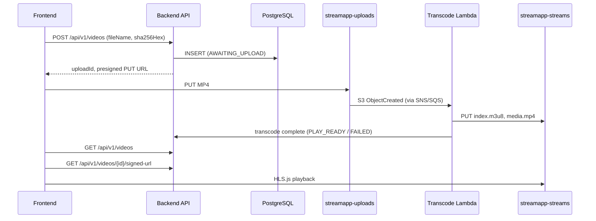
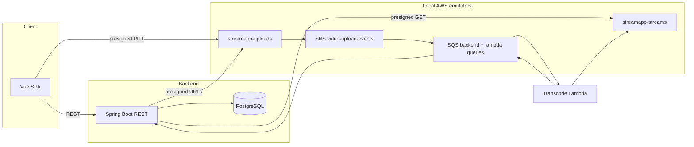

# stream-app

Video upload and HLS streaming platform. Clients upload MP4 files via presigned S3 URLs; the backend tracks metadata, deduplicates by SHA-256, and orchestrates FFmpeg transcode to fMP4 HLS for browser playback.

## Details

- **Upload:** Vue SPA hashes files locally (SHA-256), requests a presigned PUT URL, uploads directly to object storage, and supports per-file retry on failure. Duplicate uploads return RFC 7807 `409` responses.
- **Transcode:** S3 upload events fan out via SNS/SQS to a GraalVM native Spring Cloud Function Lambda (FFmpeg → `index.m3u8` + `media.mp4` in `streamapp-streams`).
- **Playback:** Stream tab lists videos with auto-polling while items transcode, fetches a presigned manifest URL for `PLAY_READY` items, and plays via hls.js.
- **API:** `POST /api/v1/videos`, `GET /api/v1/videos`, `GET /api/v1/videos/{uploadId}/signed-url` — see [`docs/PROJECT.md`](docs/PROJECT.md) for request/response shapes and error codes.
- **Tests:** Backend and transcode-lambda integration tests use Testcontainers (PostgreSQL 18 + Floci); frontend has Vitest unit/component coverage (78 tests). Shared messaging fixtures live in `test-fixtures/`.

Canonical architecture, APIs, and setup live in [`docs/PROJECT.md`](docs/PROJECT.md).

## Tech stack

| Layer | Technology |
|-------|------------|
| Backend | Java 25, Spring Boot 4.1, PostgreSQL 18, Flyway, jOOQ |
| Messaging | Spring Cloud AWS (S3, SQS), SNS fan-out |
| Transcode | GraalVM native Lambda, FFmpeg |
| Frontend | Vue 3, Vite 8, TypeScript, Tailwind CSS v4, hls.js |
| Local infra | Docker Compose (PostgreSQL, Floci S3 emulator) |
| Testing | JUnit 5 + Testcontainers (PostgreSQL + Floci), Vitest 4 |

## Sequence diagram



## Architecture



## Local development

Recommended startup order: database → Floci → backend (creates S3 buckets) → AWS init → frontend.

1. **Database:** `docker compose -f docker/infra/db/docker-compose.yaml up -d`
2. **Local S3 (Floci):** `docker compose -f docker/infra/aws/docker-compose.yaml up -d`
3. **Backend:** `cd backend && ./mvnw spring-boot:run -Dspring-boot.run.profiles=dev`
4. **AWS init (after backend creates buckets):** re-run if the S3→SNS notification was skipped:
   - Linux/macOS: `AWS_ENDPOINT_URL=http://localhost:4566 sh docker/infra/aws/init-aws-resources.sh`
   - Windows: `$env:AWS_ENDPOINT_URL = "http://localhost:4566"; .\docker\infra\aws\init-aws-resources.ps1`
5. **Frontend:** `cd frontend && npm install && npm run dev` → http://localhost:5173

**Tests**

```bash
cd backend && ./mvnw test                    # excludes @Tag("slow") and @Tag("pipeline") by default
cd transcode-lambda && ./mvnw test
cd frontend && npm run test:run
```

See [`docs/PROJECT.md`](docs/PROJECT.md) for transcode Lambda deploy (WSL native build), full test tiers, and troubleshooting.

## License

No `LICENSE` file is present in this repository yet. Intended license: **MIT** (to be added).
