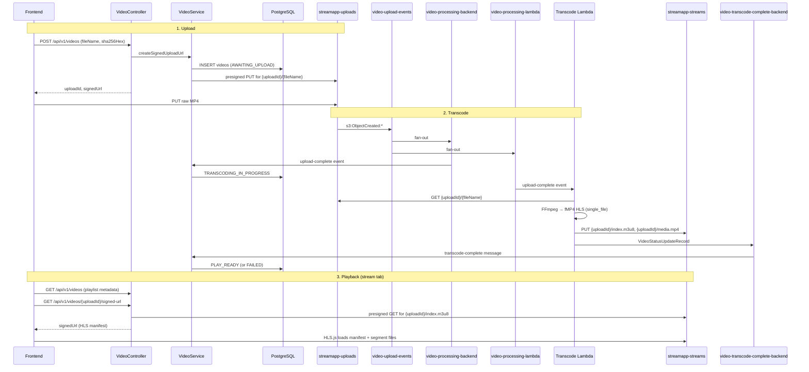

# stream-app — Project Context

> **Living document.** Read this at the start of every session. Update it whenever architecture, APIs, setup, or project status changes. See [CHANGELOG.md](./CHANGELOG.md) for a chronological record of changes.

## Overview

**stream-app** is a video upload and streaming platform (early stage). The goal is to let clients upload videos via presigned object-storage URLs while the backend tracks upload metadata, deduplicates by SHA-256, and (eventually) serves or streams content.

| Item | Value |
|------|-------|
| Package | `dev.iamkavindu.streamapp` |
| Version | `0.0.1-SNAPSHOT` |
| Repo state | Git initialized on `main`; no commits yet |
| Frontend | Vue 3 + Vite + Tailwind CSS v4 (upload + stream tabs) |

## Repository layout

```
stream-app/
├── backend/                      # Spring Boot REST API
│   └── src/main/java/.../
│       ├── video/                # Video upload domain (controller, service, repository)
│       │   └── model/            # DTOs and enums (SignedUrlCreatedRecord, VideoStatus, …)
│       ├── aws/                  # S3 integration (S3Service, ResourceInitialize)
│       └── exception/            # RFC 7807 ProblemDetail handlers
├── frontend/                     # Vue 3 SPA (upload + stream tabs)
│   └── src/
│       ├── features/upload/      # Upload API, composable, UI components
│       ├── features/stream/      # Stream API, playback composable, HLS player UI
│       ├── pages/                # Route-level screens
│       ├── router/               # Vue Router
│       └── shared/               # API helpers, config, utilities, shell UI
├── transcode-lambda/             # Spring Cloud Function Lambda (MP4 → HLS transcode)
│   ├── scripts/                  # FFmpeg layer + WSL native build + Floci deploy
│   └── src/main/java/.../lambda/ # Transcoder, copied S3/HLS contracts
├── test-fixtures/                # Shared JSON templates for Java integration tests
├── docker/infra/
│   ├── db/                       # Local PostgreSQL 18 (Docker Compose)
│   └── aws/                      # Local S3 via Floci + init-aws-resources.{sh,ps1}
├── demo.mp4                      # Sample file for manual upload tests
├── stream_app-endpoints.http     # HTTP client requests (IntelliJ / VS Code)
└── docs/                         # Project documentation (this file + changelog)
```

## Tech stack

| Layer | Technology |
|-------|------------|
| Language | Java 25 |
| Framework | Spring Boot 4.1.0 |
| API | Spring Web MVC |
| Database | PostgreSQL 18 |
| Migrations | Flyway |
| Data access | jOOQ (codegen via Testcontainers + Flyway at build time) |
| Validation | Spring Validation |
| Testing | JUnit 5, Testcontainers (PostgreSQL 18 + [Floci](https://floci.io/floci/testcontainers/java/) via `spring-boot-testcontainers-floci` 2.0) |
| Native builds | GraalVM native image plugin configured |
| Object storage | Spring Cloud AWS S3 (`spring-cloud-aws-starter-s3` `4.0.2`) |
| Messaging | Spring Cloud AWS SQS (`spring-cloud-aws-starter-sqs` `4.0.2`) |
| Local S3 emulator | [Floci](https://github.com/floci/floci) via Docker Compose (`localhost:4566`) |
| Frontend framework | Vue 3.5, Vue Router 5, Vite 8, TypeScript 6 |
| Frontend styling | Tailwind CSS v4 (`@tailwindcss/vite`) |
| HLS playback | hls.js |
| Frontend testing | Vitest 4, `@vue/test-utils`, happy-dom |
| Frontend runtime | Node.js `^22.18.0` or `>=24.12.0` (see `frontend/package.json` `engines`) |

## Frontend architecture

Feature-based layout under `frontend/src/`:

| Path | Role |
|------|------|
| `pages/` | Route-level screens (`UploadPage`, `StreamPage`) |
| `features/upload/` | Upload use case: API client, `useUploadQueue` composable, UI |
| `features/stream/` | Stream use case: list/signed-url API, `useStreamPlayback`, HLS.js player |
| `features/upload/types.ts` | Queue item model, upload phases, step chips, progress helpers |
| `shared/api/` | `ApiError` / RFC 7807 `ProblemDetail` parsing |
| `shared/utils/` | `sha256Hex` (Web Crypto), `putFileWithProgress` (XHR PUT) |
| `shared/config/` | `VITE_API_BASE_URL` helper |
| `shared/ui/` | App shell (`AppTabNav`) |
| `router/` | Vue Router (`/upload`, `/stream`) |

**Upload tab flow:** user adds one or more `.mp4` files via a persistent drop zone (left) → each file appears in a vertical queue (right) → per-file pipeline with step chips and a unified progress bar:

1. **Hashing** — SHA-256 via Web Crypto (`shared/utils/sha256.ts`)
2. **Creating** — `POST /api/v1/videos` for presigned PUT URL
3. **Uploading** — `PUT` to S3 with byte progress (`putFileWithProgress`)
4. **Complete** or **Failed** — per-file result; failed items show which step broke, the API error message, and a **Retry** button that re-runs the pipeline from hashing

Uploads run independently so new files can be added while others are in progress. Completed or failed items can be removed from the queue.

**Env:** `VITE_API_BASE_URL` (optional). Empty in local dev uses Vite proxy (`/api` → `http://localhost:8080`). See `frontend/.env.example`.

**Stream tab flow:** on mount, `GET /api/v1/videos` populates the library panel → user selects a video → if `status === PLAY_READY`, `GET /api/v1/videos/{uploadId}/signed-url` returns a presigned `index.m3u8` URL → `HlsPlayer` loads it with hls.js (native HLS fallback on Safari). Non-ready videos show status-specific inline messages without calling the signed-url endpoint. While any video is `AWAITING_UPLOAD` or `TRANSCODING_IN_PROGRESS`, the library auto-refreshes every 4 seconds; polling stops when all videos are terminal (`PLAY_READY` or `FAILED`) or on tab unmount. Failed transcodes show a red badge and guidance in the playlist; API errors and HLS playback errors are shown separately in the player panel.

**Error responses:** Backend returns RFC 7807 `ProblemDetail` JSON (e.g. `409` duplicate upload, `409` video-not-ready). Frontend parses `detail` / `title` and surfaces per-file or player alerts.

## Architecture (current)

The platform has three cooperating parts: **upload** (backend + frontend), **transcode** (Lambda / Spring Cloud Function, planned), and **playback** (backend + frontend + HLS.js).

### End-to-end flow



### S3 object layout (`S3ObjectKeys`)

Bucket name is **not** part of the object key. Keys are shared conventions across backend, Lambda, and frontend.

| Bucket | Object key pattern | Example | Purpose |
|--------|-------------------|---------|---------|
| `streamapp-uploads` | `{uploadId}/{fileName}` | `550e8400-…/demo.mp4` | Raw client upload (presigned PUT) |
| `streamapp-streams` | `{uploadId}/index.m3u8` | `550e8400-…/index.m3u8` | HLS media playlist (presigned GET entry point) |
| `streamapp-streams` | `{uploadId}/media.mp4` | `550e8400-…/media.mp4` | Single fMP4 media file (`-hls_flags single_file`) |

`fileName` is sanitized (basename only; unsafe characters → `_`). Stream output names are fixed (`index.m3u8`, `media.mp4`) so backend, Lambda, and frontend agree without extra DB columns. Constants live in `S3ObjectKeys`; the FFmpeg argument list is in `HlsTranscodeCommand`.

### Lambda transcode contract

The Spring Cloud Function Lambda in `transcode-lambda/`:

1. Consumes `video-processing-lambda` messages (SQS trigger; SNS-wrapped S3 `ObjectCreated` on `streamapp-uploads`).
2. Parses `uploadId` via `S3UploadEventParser` (same logic as backend).
3. Downloads the raw MP4 from `streamapp-uploads`.
4. Runs FFmpeg via `HlsTranscodeCommand.build(ffmpegPath, localInput, outputDir)`:

```java
List<String> command = HlsTranscodeCommand.build(ffmpegPath, localInput, outputDir);
// ProcessBuilder(command).start() …
```

FFmpeg flags (VOD fMP4 HLS, 4 s segments, single combined media file):

| Flag | Value | Role |
|------|-------|------|
| `-vcodec` | `libx264` | H.264 video |
| `-preset` | `fast` | Encode speed |
| `-crf` | `22` | Quality |
| `-c:a` / `-b:a` | `aac` / `128k` | Audio |
| `-f` | `hls` | HLS muxer |
| `-hls_time` | `4` | Target segment duration (seconds) |
| `-hls_playlist_type` | `vod` | On-demand playlist |
| `-hls_segment_type` | `fmp4` | Fragmented MP4 segments |
| `-hls_flags` | `single_file` | All segments in one media file |
| `-hls_segment_filename` | `{outputDir}/media.mp4` | Combined fMP4 output |
| *(final arg)* | `{outputDir}/index.m3u8` | Media playlist |

5. Upload `outputDir/index.m3u8` and `outputDir/media.mp4` to `streamapp-streams/{uploadId}/` (keys from `S3ObjectKeys.streamPlaylistKey` / `streamMediaKey`).
6. Publish a `VideoStatusUpdateRecord` JSON message to `video-transcode-complete-backend`:

```json
{
  "uploadId": "550e8400-e29b-41d4-a716-446655440000",
  "status": "PLAY_READY"
}
```

Use `"status": "FAILED"` when transcoding errors. The backend transitions `TRANSCODING_IN_PROGRESS` → `PLAY_READY` or `FAILED`.

Example stream-bucket layout after transcode:

```
streamapp-streams/{uploadId}/
  index.m3u8    ← HLS manifest; references media.mp4 relatively
  media.mp4     ← single fMP4 file (all fragments)
```

### Frontend stream tab

1. **Playlist panel** — `GET /api/v1/videos` → list `uploadId`, `fileName`, `status`.
2. **Player** — on user selection, if `status === PLAY_READY`, call `GET /api/v1/videos/{uploadId}/signed-url`.
3. **HLS.js** — `hls.loadSource(signedUrl)` where `signedUrl` is the presigned `index.m3u8`; FFmpeg writes a relative reference to `media.mp4` in the same prefix.

Only videos with status `PLAY_READY` receive a signed stream URL (`409 video-not-ready` otherwise).

### HLS playback and segment auth

A presigned URL covers **one** S3 object. HLS.js loads `index.m3u8` first, then fetches `media.mp4` using a relative path from the manifest — that request does **not** include the manifest’s presign query string.

| Environment | Recommended approach |
|-------------|---------------------|
| **Production** | CloudFront in front of `streamapp-streams` with **signed cookies** (or signed URLs) scoped to `/{uploadId}/*`, or a backend media proxy |
| **Local dev (Floci)** | Permissive read on `streamapp-streams` prefix, or backend proxy; stream-bucket CORS (`GET`, `HEAD`) is configured for browser playback |

The backend currently returns a presigned GET for `{uploadId}/index.m3u8` only. Plan CloudFront signed cookies (or a proxy) before production HLS playback on a private bucket.

Buckets and CORS are created by the backend on startup (`ResourceInitialize`, `dev` profile). SNS topic, SQS queues, and S3→SNS event notification are provisioned by `docker/infra/aws/init-aws-resources.sh` (Compose `aws-init`) or `init-aws-resources.ps1` (Windows host).

**SQS listeners** (`VideoService`, `ON_SUCCESS` ack):

| Queue | Handler | Transition |
|-------|---------|------------|
| `video-processing-backend` | `onUploadComplete` | `AWAITING_UPLOAD` → `TRANSCODING_IN_PROGRESS` |
| `video-transcode-complete-backend` | `onTranscodeComplete` | `TRANSCODING_IN_PROGRESS` → `PLAY_READY` or `FAILED` |

Upload events arrive SNS-wrapped (S3 `ObjectCreated` fan-out from `video-upload-events`). Transcode-complete messages are plain JSON (`VideoStatusUpdateRecord`).

## Domain model

Table: `videos` (Flyway `V1__create_videos.sql`)

| Column | Type | Notes |
|--------|------|-------|
| `upload_id` | UUID PK | Per-upload identifier |
| `status` | VARCHAR(50) | `VideoStatus` enum value (see below) |
| `file_name` | VARCHAR(255) | Original filename |
| `sha256_hash` | BYTEA | Unique index — deduplication |
| `created_at` | TIMESTAMPTZ | |
| `updated_at` | TIMESTAMPTZ | |

### `VideoStatus` enum

| Value | Meaning |
|-------|---------|
| `AWAITING_UPLOAD` | DB row created; client has not finished S3 PUT |
| `TRANSCODING_IN_PROGRESS` | Upload landed in S3; transcode in progress |
| `PLAY_READY` | HLS output in stream bucket; ready to play |
| `FAILED` | Upload or transcoding failed |

## API (current)

| Method | Path | Status | Description |
|--------|------|--------|-------------|
| `GET` | `/api/v1/videos` | Implemented | List all videos from the `videos` table |
| `GET` | `/api/v1/videos/{uploadId}/signed-url` | Implemented | Presigned S3 GET URL for `{uploadId}/index.m3u8` in `streamapp-streams` (HLS manifest; `PLAY_READY` only) |
| `POST` | `/api/v1/videos` | Implemented | Create pending upload row and return presigned S3 PUT URL |

**Request body** (`SignedUrlCreateRequest` — validated with `@Valid`):

```json
{
  "fileName": "dummy.mp4",
  "sha256Hex": "<64-char hex SHA-256>"
}
```

| Field | Validation |
|-------|------------|
| `fileName` | Not blank; max 255 characters |
| `sha256Hex` | Exactly 64 hexadecimal characters |

Invalid requests return `400 Bad Request` (`validation-failed` ProblemDetail).

**Response** `201 Created` (`SignedUrlCreatedRecord`):

```json
{
  "uploadId": "550e8400-e29b-41d4-a716-446655440000",
  "signedUrl": "http://localhost:4566/streamapp-uploads/...",
  "fileName": "dummy.mp4"
}
```

**Follow-up (client-side):** `PUT` the video bytes to `signedUrl` with appropriate `Content-Type` (e.g. `video/mp4`). See `stream_app-endpoints.http`.

**List videos** `200 OK` (`VideoRecord[]`):

```json
[
  {
    "uploadId": "550e8400-e29b-41d4-a716-446655440000",
    "status": "AWAITING_UPLOAD",
    "fileName": "dummy.mp4",
    "createdAt": "2026-06-27T12:00:00Z",
    "updatedAt": "2026-06-27T12:00:00Z"
  }
]
```

**Signed stream URL** `200 OK` (`SignedGetUrlRecord`) — only when `status` is `PLAY_READY`:

```json
{
  "uploadId": "550e8400-e29b-41d4-a716-446655440000",
  "objectKey": "550e8400-e29b-41d4-a716-446655440000/index.m3u8",
  "signedUrl": "http://localhost:4566/streamapp-streams/.../index.m3u8?..."
}
```

Pass `signedUrl` to HLS.js as the manifest source. The manifest references `media.mp4` in the same `{uploadId}/` prefix (see **HLS playback and segment auth** above).

Returns `404 Not Found` when `uploadId` is not in the database. Returns `409 Conflict` (`video-not-ready`) when the video exists but is not `PLAY_READY`.

**Orphan upload cleanup:** a scheduled job marks `AWAITING_UPLOAD` rows as `FAILED` when the client never completes the S3 PUT within a configurable TTL (default 30 minutes). Config in `application-dev.properties`:

| Property | Default | Purpose |
|----------|---------|---------|
| `streamapp.upload.awaiting-upload-ttl` | `30m` | Age after which pending uploads are failed |
| `streamapp.upload.cleanup-interval` | `5m` | Delay between cleanup runs |
| `streamapp.upload.cleanup.enabled` | `true` | Toggle scheduled cleanup |

**Error response** `409 Conflict` (RFC 7807 `application/problem+json`) when SHA-256 already exists:

```json
{
  "type": "https://stream-app.dev/problems/duplicate-video-upload",
  "title": "Duplicate Video Upload",
  "status": 409,
  "detail": "Video is already uploaded: dummy.mp4"
}
```

## Implementation status

### Done

- Spring Boot project scaffold (`BackendApplication`)
- Flyway migration for `videos` table
- jOOQ codegen via Testcontainers (PostgreSQL 18) + Flyway migrations at build time
- Docker Compose for local PostgreSQL and local S3 (Floci)
- `VideoStatus` enum and jOOQ-backed `VideoRepository`
- Signed upload flow: `VideoController` → `VideoService` → `S3Service`
- SHA-256 duplicate rejection (`409` ProblemDetail via `BackendExceptionHandler`)
- S3 presigned PUT URLs (15-minute expiry) via Spring Cloud AWS `S3Template`
- Auto-create S3 buckets and upload-bucket CORS on backend startup (`ResourceInitialize`)
- Spring Cloud AWS SQS (`spring-cloud-aws-starter-sqs`) for upload-complete and transcode-complete events
- Floci dev bootstrap: SNS `video-upload-events`, SQS `video-processing-backend` / `video-processing-lambda` / `video-transcode-complete-backend`, S3→SNS notification (`init-aws-resources.sh`, Compose `aws-init`)
- `@SqsListener` handlers: upload complete → `TRANSCODING_IN_PROGRESS`; transcode complete → `PLAY_READY` / `FAILED`
- `S3UploadEventParser` — SNS-wrapped S3 `ObjectCreated` parsing
- `AwsMessagingResources` — shared queue and topic names
- `S3ObjectKeys` — shared upload/stream key layout (`{uploadId}/{fileName}`, `{uploadId}/index.m3u8`)
- `S3Service.createSignedPlaylistGetUrl` — presigned GET for HLS manifest in stream bucket
- RFC 7807 error handling (`BackendExceptionHandler`, `ProblemTypes`, `DuplicateVideoUploadException`)
- Manual API test file (`stream_app-endpoints.http`) and sample `demo.mp4`
- Backend tests: unit + integration via Testcontainers (PostgreSQL 18 + Floci): repository, S3 presign, REST API, direct and async SQS listeners (`@MessagingIntegrationTest`), upload flow, stale cleanup, RFC 7807 handler tests, shared contract fixtures (`test-fixtures/`); default `./mvnw test` excludes `@Tag("slow")` and `@Tag("pipeline")`
- transcode-lambda tests: unit parsers/command builder + Floci integration (`TranscoderFailureIntegrationTest`); `@Tag("slow")` real FFmpeg transcode when FFmpeg is on PATH
- Vue 3 frontend with tabbed navigation (Upload | Stream)
- Upload tab: persistent MP4 drop zone, multi-file queue, step chips, unified progress bar, per-file SHA-256 / signed-url / S3 PUT, RFC 7807 error alerts, and retry on failed uploads
- Stream tab: video library from `GET /api/v1/videos`, auto-polling while videos transcode, signed manifest fetch, HLS.js player with distinct API vs playback error messages, failed-state playlist UX (`features/stream/`)
- Vitest unit/component tests for upload and stream flows (78 tests across 18 files: composables, API clients, pure helpers, and UI components including `HlsPlayer`, `StreamPanel`, `FileDropZone`)
- Transcode Lambda module (`transcode-lambda/`): SQS-triggered `Consumer<byte[]>` (raw SQS JSON parsed with Spring Jackson, not AWS `SQSEvent` serializers), SNS-wrapped S3 parsing, `HlsTranscodeCommand`, stream-bucket upload, `VideoStatusUpdateRecord` to `video-transcode-complete-backend`; WSL native build + Floci deploy scripts under `transcode-lambda/scripts/`
- Root `README.md` with overview, diagrams, and local dev quick start
- `POST /api/v1/videos` Bean Validation (`400 validation-failed` ProblemDetail)
- Scheduled cleanup of stale `AWAITING_UPLOAD` rows (`StaleUploadCleanupJob`)

### Not done

- End-to-end transcode verification on local Floci Lambda (requires WSL native build + FFmpeg layer deploy)
- Authentication / authorization
- `LICENSE` file (README notes intended MIT license)

## Local development

Start infrastructure, then run the backend with the `dev` profile.

### Database

```bash
docker compose -f docker/infra/db/docker-compose.yaml up -d
```

| Setting | Value |
|---------|-------|
| Host | `localhost:5432` |
| Database | `streamappdb` |
| User / password | `streamapp` / `streamapp` |

### Local S3 (Floci)

```bash
docker compose -f docker/infra/aws/docker-compose.yaml up -d
```

| Service | Port | Purpose |
|---------|------|---------|
| Floci (S3 API) | `4566` | S3-compatible endpoint for uploads |
| Floci UI | `4500` | Web UI for browsing buckets/objects |
| `aws-init` | — | One-shot init: SNS topic, SQS queues, S3→SNS notification |

Floci uses hybrid persistent storage under `docker/infra/aws/data/`.

**Init order:** `aws-init` waits up to 120s for `streamapp-uploads` (created when the backend starts). If the bucket is not ready in time, the queue is still created but the S3 notification is skipped — re-run the script after starting the backend:

```bash
# From repo root (host; uses localhost:4566)
AWS_ENDPOINT_URL=http://localhost:4566 sh docker/infra/aws/init-aws-resources.sh

# Or re-run only the init container
docker compose -f docker/infra/aws/docker-compose.yaml run --rm aws-init
```

```powershell
# Windows host (requires AWS CLI on PATH; Floci on localhost:4566)
$env:AWS_ENDPOINT_URL = "http://localhost:4566"
.\docker\infra\aws\init-aws-resources.ps1
```

**What init provisions (idempotent):**

| Resource | Name | Notes |
|----------|------|-------|
| SNS topic | `video-upload-events` | Receives `s3:ObjectCreated:*` from upload bucket |
| SQS queue | `video-processing-backend` | SNS fan-out; backend sets `TRANSCODING_IN_PROGRESS` |
| SQS queue | `video-processing-lambda` | SNS fan-out; Lambda transcode trigger (planned) |
| SQS queue | `video-transcode-complete-backend` | Lambda → backend `PLAY_READY` / `FAILED` |
| Topic / queue policies | — | S3 → SNS; SNS → SQS; Lambda → transcode-complete queue |
| S3 notification | `streamapp-uploads` → SNS | Event `s3:ObjectCreated:*` |

Buckets (`streamapp-uploads`, `streamapp-streams`) and browser CORS remain backend responsibilities (`ResourceInitialize`, `dev` profile).

### Backend

```bash
cd backend
./mvnw spring-boot:run -Dspring-boot.run.profiles=dev
```

| Setting | Value |
|---------|-------|
| Profile | `dev` (`application-dev.properties`) |
| Flyway schema | `streamapp` |
| S3 endpoint | `http://localhost:4566` |
| S3 region | `us-east-1` |
| Path-style access | enabled (`spring.cloud.aws.s3.path-style-access-enabled=true`) |

Build requires Docker for jOOQ code generation (`./mvnw` from `backend/`).

### Frontend

```bash
cd frontend
npm install
npm run dev
```

| Setting | Value |
|---------|-------|
| Dev server | Vite default (`http://localhost:5173`) |
| API proxy | `/api` → `http://localhost:8080` (see `vite.config.ts`) |
| API base URL | `VITE_API_BASE_URL` (optional; see `.env.example`) |

```bash
npm run test:run   # Vitest
npm run build      # type-check + production build
```

### Transcode Lambda (native, WSL)

Build and deploy to local Floci from `transcode-lambda/` (Windows host; native compile runs in WSL):

```powershell
cd transcode-lambda
.\scripts\00-pre-setup-ffmpeg-layer.ps1   # download FFmpeg → staging/ffmpeg-layer.zip (zip layout: bin/ffmpeg → /opt/bin/ffmpeg)
.\scripts\01-publish-ffmpeg-layer.ps1   # publish layer to Floci (re-run after 00 if layer path was wrong)
.\scripts\02-build-native-lambda.ps1      # WSL: ./mvnw -Pnative native:compile
.\scripts\03-package-native-lambda.ps1    # ZIP bootstrap for provided.al2023
.\scripts\04-deploy-native-lambda.ps1     # create/update streamapp-transcode-lambda + SQS mapping
```

WSL needs GraalVM JDK 25+ with `native-image`. FFmpeg is supplied via the `local-ffmpeg-layer` Lambda layer at `/opt/bin/ffmpeg` (layer ZIP must use `bin/ffmpeg` at the archive root, not `opt/bin/ffmpeg`, so Floci mounts it at the correct path). The function consumes `video-processing-lambda` and publishes `VideoStatusUpdateRecord` JSON to `video-transcode-complete-backend`. The handler is `Consumer<byte[]>`: raw SQS event JSON is parsed with Spring Jackson (`S3UploadEventParser.parseSqsEnvelopeBodies`) instead of AWS `LambdaEventSerializers`/`SQSEvent`, which do not populate records reliably in GraalVM native images.

JVM compile/tests (no native image): `./mvnw test` from `transcode-lambda/`.

### Known setup notes

- `V1__create_videos.sql` does not create the `streamapp` schema; Flyway `default-schema=streamapp` and jOOQ codegen `createSchemas=true` handle schema creation — align these if startup fails.
- jOOQ code generation spins up a temporary PostgreSQL container (Testcontainers). Docker must be running for `mvn compile` / `mvn package`. Skip with `-Djooq.codegen.skip=true` only if generated sources already exist.
- **Backend tests** (`cd backend && ./mvnw test`): PostgreSQL 18 + Floci via Testcontainers. Default excludes `@Tag("slow")` and `@Tag("pipeline")`. Run all: `./mvnw test -DexcludedGroups=`. Slow only: `-Dgroups=slow`. Pipeline: `-Dgroups=pipeline`.
- **transcode-lambda tests** (`cd transcode-lambda && ./mvnw test`): Floci Testcontainers; failure-path transcode test runs without FFmpeg; real transcode tests need FFmpeg on PATH (`@Tag("slow")`, excluded by default).
- Recommended dev startup order: DB → Floci (`docker compose up`) → backend (creates S3 buckets) → re-run `aws-init` if the upload-bucket notification was skipped.

### jOOQ code generation

Uses `testcontainers-jooq-codegen-maven-plugin` (not `DDLDatabase`). The old `DDLDatabase` approach parses PostgreSQL DDL but **always simulates schema creation in H2**, so PostgreSQL-specific features (e.g. unique indexes on `BYTEA`) can fail even when `dialect=POSTGRESQL` is set. The Testcontainers plugin applies Flyway migrations to a real PostgreSQL 18 container and reverse-engineers with `PostgresDatabase`.

| Setting | Value |
|---------|-------|
| Plugin | `dev.sivalabs:testcontainers-jooq-codegen-maven-plugin` |
| Flyway schema | `streamapp` (`createSchemas=true`) |
| Generated package | `dev.iamkavindu.streamapp.backend.jooq` |
| Skip flag | `-Djooq.codegen.skip=true` |

## Key files

| Path | Purpose |
|------|---------|
| `backend/pom.xml` | Dependencies, jOOQ codegen, GraalVM native, Spring Cloud AWS S3 + SQS |
| `backend/src/main/resources/application-dev.properties` | Local DB + Floci endpoint + orphan upload cleanup config |
| `backend/src/main/resources/db/migration/` | Flyway migrations |
| `backend/src/main/java/.../video/VideoController.java` | `GET` / `POST` `/api/v1/videos`, `GET` signed stream URL |
| `backend/src/main/java/.../video/VideoService.java` | Upload orchestration + dual `@SqsListener` handlers |
| `backend/src/main/java/.../video/VideoRepository.java` | jOOQ insert + conditional `updateStatus` |
| `backend/src/main/java/.../aws/AwsMessagingResources.java` | SNS topic and SQS queue names |
| `backend/src/main/java/.../aws/S3UploadEventParser.java` | Parse SNS-wrapped S3 upload events |
| `backend/src/main/java/.../video/model/VideoStatusUpdateRecord.java` | Lambda transcode-complete message DTO |
| `backend/src/main/java/.../transcode/HlsTranscodeCommand.java` | Shared FFmpeg command for fMP4 HLS (`single_file`) |
| `backend/src/main/java/.../aws/S3ObjectKeys.java` | Shared S3 key conventions (`index.m3u8`, `media.mp4`) |
| `backend/src/main/java/.../aws/S3Service.java` | Presigned PUT (upload) and GET (HLS playlist) URLs |
| `backend/src/main/java/.../aws/ResourceInitialize.java` | S3 bucket + CORS bootstrap on startup |
| `backend/src/main/java/.../exception/BackendExceptionHandler.java` | RFC 7807 `ProblemDetail` responses |
| `docker/infra/db/docker-compose.yaml` | Local Postgres 18 |
| `docker/infra/aws/docker-compose.yaml` | Local S3 (Floci) + `aws-init` |
| `docker/infra/aws/init-aws-resources.sh` | Floci SNS/SQS + S3 event notification bootstrap (shell; Compose `aws-init`) |
| `docker/infra/aws/init-aws-resources.ps1` | Same bootstrap for Windows host (PowerShell + AWS CLI) |
| `stream_app-endpoints.http` | Manual upload test (POST + PUT) |
| `frontend/src/features/upload/composables/useUploadQueue.ts` | Multi-file upload queue state machine |
| `frontend/src/features/stream/composables/useStreamPlayback.ts` | Video list, polling, signed URL fetch, status messages |
| `frontend/src/features/stream/utils/hlsErrors.ts` | Human-readable hls.js fatal error messages |
| `frontend/src/features/stream/ui/HlsPlayer.vue` | hls.js video element wrapper |
| `frontend/src/shared/api/apiError.ts` | API error parsing for upload failures |
| `frontend/vite.config.ts` | Vite, Tailwind, API proxy, Vitest |
| `transcode-lambda/.../Transcoder.java` | SQS-triggered transcode function |
| `transcode-lambda/.../aws/S3UploadEventParser.java` | SNS-wrapped S3 upload event parsing (copy of backend) |
| `transcode-lambda/.../transcode/HlsTranscodeCommand.java` | FFmpeg argument builder (copy of backend) |
| `transcode-lambda/scripts/` | FFmpeg layer, WSL native build, Lambda ZIP package, Floci deploy |

## Documentation policy

1. **Read** `docs/PROJECT.md` before significant work in this repo.
2. **Update** `docs/PROJECT.md` when stack, architecture, APIs, setup, or status changes.
3. **Append** every meaningful change to `docs/CHANGELOG.md` (date, summary, files touched).
4. Enforced by Cursor rule: `.cursor/rules/project-documentation.mdc`.
