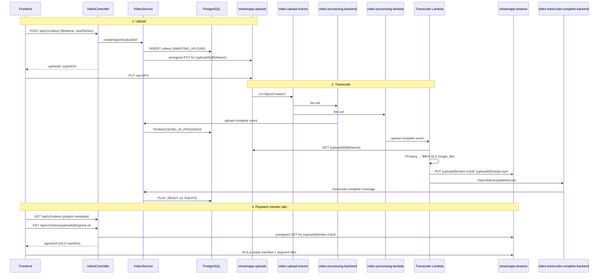

# stream-app — Project Context

> **Living document.** Read this at the start of every session. Update it whenever architecture, APIs, setup, or project status changes. See [CHANGELOG.md](./CHANGELOG.md) for a chronological record of changes.

## Overview

**stream-app** is a locally hosted video upload and HLS streaming demo. Clients upload via presigned object-storage URLs; the backend tracks metadata and SHA-256 duplicates, and a separate Lambda transcodes media for playback through Floci-emulated AWS services.

Prioritized implementation work, acceptance criteria, and dependencies are tracked in [BACKLOG.md](./BACKLOG.md). That backlog describes proposals; this document describes implemented behavior.

| Item | Value |
|------|-------|
| Package | `dev.iamkavindu.streamapp` |
| Version | `0.0.1-SNAPSHOT` |
| Development baseline | `main` at `9db5dfc` for the 2026-10-05 review |
| Frontend | Vue 3 + Vite + Tailwind CSS v4 (upload + stream tabs) |

## Repository layout

```
stream-app/
├── backend/                      # Spring Boot REST API
│   └── src/main/java/.../
│       ├── video/                # Video upload domain (controller, service, repository)
│       │   └── model/            # DTOs and enums (SignedUrlCreatedRecord, VideoStatus, …)
│       ├── aws/                  # S3 integration (S3Service, ResourceInitialize)
│       └── exception/            # RFC 7807 ProblemDetail handlers
├── frontend/                     # Vue 3 SPA (upload + stream tabs)
│   └── src/
│       ├── features/upload/      # Upload API, composable, UI components
│       ├── features/stream/      # Stream API, playback composable, HLS player UI
│       ├── pages/                # Route-level screens
│       ├── router/               # Vue Router
│       └── shared/               # API helpers, config, utilities, shell UI
├── transcode-lambda/             # Spring Cloud Function Lambda (MP4 → HLS transcode)
│   ├── scripts/                  # FFmpeg layer + WSL native build + Floci deploy
│   └── src/main/java/.../lambda/ # Transcoder, copied S3/HLS contracts
├── test-fixtures/                # Shared JSON templates for Java integration tests
├── docker/infra/
│   ├── db/                       # Local PostgreSQL 18 (Docker Compose)
│   └── aws/                      # Local S3 via Floci + init-aws-resources.{sh,ps1}
├── demo.mp4                      # Sample file for manual upload tests
├── stream_app-endpoints.http     # HTTP client requests (IntelliJ / VS Code)
└── docs/                         # Project documentation (this file + changelog)
```

## Tech stack

| Layer | Technology |
|-------|------------|
| Language | Java 25 |
| Framework | Spring Boot 4.1.0 |
| API | Spring Web MVC |
| Database | PostgreSQL 18 |
| Migrations | Flyway |
| Data access | jOOQ (codegen via Testcontainers + Flyway at build time) |
| Validation | Spring Validation |
| Testing | JUnit 5, Testcontainers (PostgreSQL 18 + [Floci](https://floci.io/floci/testcontainers/java/) via `spring-boot-testcontainers-floci` 2.0) |
| Native builds | GraalVM native image plugin configured |
| Object storage | Spring Cloud AWS S3 (`spring-cloud-aws-starter-s3` `4.0.2`) |
| Messaging | Spring Cloud AWS SQS (`spring-cloud-aws-starter-sqs` `4.0.2`) |
| Local S3 emulator | [Floci](https://github.com/floci/floci) via Docker Compose (`localhost:4566`) |
| Frontend framework | Vue 3.5, Vue Router 5, Vite 8, TypeScript 6 |
| Frontend styling | Tailwind CSS v4 (`@tailwindcss/vite`) |
| HLS playback | hls.js |
| Frontend testing | Vitest 4, `@vue/test-utils`, happy-dom |
| Frontend runtime | Node.js `^22.18.0` or `>=24.12.0` (see `frontend/package.json` `engines`) |

## Frontend architecture

Feature-based layout under `frontend/src/`:

| Path | Role |
|------|------|
| `pages/` | Route-level screens (`UploadPage`, `StreamPage`) |
| `features/upload/` | Upload use case: API client, `useUploadQueue` composable, UI |
| `features/stream/` | Stream use case: list/signed-url API, `useStreamPlayback`, HLS.js player |
| `features/upload/types.ts` | Queue item model, upload phases, step chips, progress helpers |
| `shared/api/` | `ApiError` / RFC 7807 `ProblemDetail` parsing |
| `shared/utils/` | `sha256Hex` (Web Crypto), `putFileWithProgress` (XHR PUT) |
| `shared/config/` | `VITE_API_BASE_URL` helper |
| `shared/ui/` | App shell (`AppTabNav`) |
| `router/` | Vue Router (`/upload`, `/stream`) |

**Upload tab flow:** user adds one or more `.mp4` files via a persistent drop zone (left) → each file appears in a vertical queue (right) → per-file pipeline with step chips and a unified progress bar:

1. **Hashing** — SHA-256 via Web Crypto (`shared/utils/sha256.ts`)
2. **Creating** — `POST /api/v1/videos` for presigned PUT URL
3. **Uploading** — `PUT` to S3 with byte progress (`putFileWithProgress`)
4. **Complete** or **Failed** — registration is retained before PUT. After a transfer failure, **Retry** checks the existing upload and obtains a fresh URL without another registration or hash. If the source already arrived, it skips PUT. Failure before a registration response still restarts registration; lost-response idempotency remains the next SA-005 slice.

Uploads run independently so new files can be added while others are in progress. Completed or failed items can be removed from the queue. Queue identity survives retries while this composable remains mounted; navigation/refresh persistence remains SA-018. Browser PUT sends `If-None-Match: *` to reject writes to an existing source when the emulator supports the condition. Floci acceptance is covered by `conditionalPresignedPut_preventsOverwriteOnFloci` and requires local execution. Older Floci images had a [conditional-write gap](https://github.com/floci-io/floci/issues/565) fixed in [upstream PR #566](https://github.com/floci-io/floci/pull/566); keep this test as a merge gate against the actual image. Direct clients must send the same header; the signed URL alone does not enforce the condition.

**Env:** `VITE_API_BASE_URL` (optional). Empty in local dev uses Vite proxy (`/api` → `http://localhost:8080`). See `frontend/.env.example`.

**Stream tab flow:** on mount, `GET /api/v1/videos` populates the library panel → user selects a video → if `status === PLAY_READY`, `GET /api/v1/videos/{uploadId}/signed-url` returns a presigned `index.m3u8` URL → `HlsPlayer` loads it with hls.js (native HLS fallback on Safari). Non-ready videos show status-specific inline messages without calling the signed-url endpoint. While any video is `AWAITING_UPLOAD` or `TRANSCODING_IN_PROGRESS`, the library auto-refreshes every 4 seconds; polling stops when all videos are terminal (`PLAY_READY` or `FAILED`) or on tab unmount. SA-019 slice 1 shares one in-flight library request between polling and Refresh, schedules the next poll four seconds after completion, and backs off list errors to 8/16/32 seconds (resetting on success). Only the latest video selection may update URL/error/loading; late callbacks after unmount are ignored. A refreshed library clears removed selections and invalidates non-ready playback; a selected processing video starts playback when it becomes ready. Failed transcodes show a red badge and guidance in the playlist; API errors and HLS playback errors are shown separately in the player panel.

**Error responses:** Backend returns RFC 7807 `ProblemDetail` JSON (e.g. `409` duplicate upload, `409` video-not-ready). Frontend parses `detail` / `title` and surfaces per-file or player alerts.

## Architecture (current)

The platform has three cooperating parts: **upload** (backend + frontend), **transcode** (Lambda / Spring Cloud Function), and **playback** (backend + frontend + HLS.js).

### End-to-end flow


```mermaid
sequenceDiagram
    participant FE as Frontend
    participant API as VideoController
    participant Svc as VideoService
    participant DB as PostgreSQL
    participant Up as streamapp-uploads
    participant SNS as video-upload-events
    participant Qb as video-processing-backend
    participant Ql as video-processing-lambda
    participant Lambda as Transcode Lambda
    participant Str as streamapp-streams
    participant Qc as video-transcode-complete-backend

    Note over FE,Up: 1. Upload
    FE->>API: POST /api/v1/videos (fileName, sha256Hex)
    API->>Svc: createSignedUploadUrl
    Svc->>DB: INSERT videos (AWAITING_UPLOAD)
    Svc->>Up: presigned PUT for {uploadId}/{fileName}
    API-->>FE: uploadId, signedUrl
    FE->>Up: PUT raw MP4

    Note over Up,Lambda: 2. Transcode
    Up->>SNS: s3:ObjectCreated:*
    SNS->>Qb: fan-out
    SNS->>Ql: fan-out
    Qb->>Svc: upload-complete event
    Svc->>DB: TRANSCODING_IN_PROGRESS
    Ql->>Lambda: upload-complete event
    Lambda->>Up: GET {uploadId}/{fileName}
    Lambda->>Lambda: FFmpeg → fMP4 HLS (single_file)
    Lambda->>Str: PUT {uploadId}/index.m3u8, {uploadId}/media.mp4
    Lambda->>Qc: VideoStatusUpdateRecord
    Qc->>Svc: transcode-complete message
    Svc->>DB: PLAY_READY (or FAILED)

    Note over FE,Str: 3. Playback (stream tab)
    FE->>API: GET /api/v1/videos (playlist metadata)
    FE->>API: GET /api/v1/videos/{uploadId}/signed-url
    API->>Str: presigned GET for {uploadId}/index.m3u8
    API-->>FE: signedUrl (HLS manifest)
    FE->>Str: HLS.js loads manifest + segment files
```

### S3 object layout (`S3ObjectKeys`)

Bucket name is **not** part of the object key. Keys are shared conventions across backend, Lambda, and frontend.

| Bucket | Object key pattern | Example | Purpose |
|--------|-------------------|---------|---------|
| `streamapp-uploads` | `{uploadId}/{fileName}` | `550e8400-…/demo.mp4` | Raw client upload (presigned PUT) |
| `streamapp-streams` | `{uploadId}/index.m3u8` | `550e8400-…/index.m3u8` | HLS media playlist (presigned GET entry point) |
| `streamapp-streams` | `{uploadId}/media.mp4` | `550e8400-…/media.mp4` | Single fMP4 media file (`-hls_flags single_file`) |

`fileName` is sanitized (basename only; unsafe characters → `_`). Stream output names are fixed (`index.m3u8`, `media.mp4`) so backend, Lambda, and frontend agree without extra DB columns. Constants live in `S3ObjectKeys`; the FFmpeg argument list is in `HlsTranscodeCommand`.

### Lambda transcode contract

The Spring Cloud Function Lambda in `transcode-lambda/`:

1. Consumes `video-processing-lambda` messages (SQS trigger; SNS-wrapped S3 `ObjectCreated` on `streamapp-uploads`).
2. Parses `uploadId` via `S3UploadEventParser` (same logic as backend).
3. Downloads the raw MP4 from `streamapp-uploads`.
4. Runs FFmpeg via `HlsTranscodeCommand.build(ffmpegPath, localInput, outputDir)`:

```java
List<String> command = HlsTranscodeCommand.build(ffmpegPath, localInput, outputDir);
// ProcessBuilder(command).start() …
```

FFmpeg flags (VOD fMP4 HLS, 4 s segments, single combined media file):

| Flag | Value | Role |
|------|-------|------|
| `-vcodec` | `libx264` | H.264 video |
| `-preset` | `fast` | Encode speed |
| `-crf` | `22` | Quality |
| `-c:a` / `-b:a` | `aac` / `128k` | Audio |
| `-f` | `hls` | HLS muxer |
| `-hls_time` | `4` | Target segment duration (seconds) |
| `-hls_playlist_type` | `vod` | On-demand playlist |
| `-hls_segment_type` | `fmp4` | Fragmented MP4 segments |
| `-hls_flags` | `single_file` | All segments in one media file |
| `-hls_segment_filename` | `{outputDir}/media.mp4` | Combined fMP4 output |
| *(final arg)* | `{outputDir}/index.m3u8` | Media playlist |

5. Upload `outputDir/index.m3u8` and `outputDir/media.mp4` to `streamapp-streams/{uploadId}/` (keys from `S3ObjectKeys.streamPlaylistKey` / `streamMediaKey`).
6. Publish a `VideoStatusUpdateRecord` JSON message to `video-transcode-complete-backend`:

```json
{
  "uploadId": "550e8400-e29b-41d4-a716-446655440000",
  "status": "PLAY_READY"
}
```

Use `"status": "FAILED"` for a nonzero FFmpeg exit only after that result has been accepted by SQS. The backend atomically transitions either `AWAITING_UPLOAD` or `TRANSCODING_IN_PROGRESS` → `PLAY_READY` or `FAILED`, allowing completion to arrive before the separate upload notification.

**Result publication and redelivery (SA-004):** Queue lookup, serialization, and send failures propagate out of the function. A failed `PLAY_READY` send is never converted to `FAILED`. A nonzero FFmpeg exit publishes `FAILED`; failure to publish it also fails the invocation. Source download, output upload, temporary-file/output-artifact problems, and inability to start FFmpeg fail the invocation without publishing a terminal result. Interrupted workers restore the interrupt flag. The existing best-effort temporary-directory cleanup runs in `finally` on every path, including publication failure; stricter cleanup/process bounds remain SA-012.

The current nonzero FFmpeg exit policy is retained; exit code alone does not identify every failure cause. More detailed media validation/failure classification remains SA-011. Redelivery can redo the transcode and overwrite output; attempt identity/idempotency remain SA-008/SA-009. The consumer throws for the whole batch, so earlier successful records may also be redelivered. SA-006 slice 1 configures five receives before DLQ delivery, a 1,800-second Lambda source visibility window, and explicit retention; the user verified repeat provisioning, payload preservation, five-receive exhaustion, and DLQ replay on pinned Floci. Native delivery verification remains pending. Deployed/native Lambda redelivery still needs local acceptance verification.

Example stream-bucket layout after transcode:

```
streamapp-streams/{uploadId}/
  index.m3u8    ← HLS manifest; references media.mp4 relatively
  media.mp4     ← single fMP4 file (all fragments)
```

### Frontend stream tab

1. **Playlist panel** — `GET /api/v1/videos` → list `uploadId`, `fileName`, `status`.
2. **Player** — on user selection, if `status === PLAY_READY`, call `GET /api/v1/videos/{uploadId}/signed-url`.
3. **HLS.js** — `hls.loadSource(signedUrl)` where `signedUrl` is the presigned `index.m3u8`; FFmpeg writes a relative reference to `media.mp4` in the same prefix.

Only videos with status `PLAY_READY` receive a signed stream URL (`409 video-not-ready` otherwise).

### HLS playback and segment auth

A presigned URL covers **one** S3 object. HLS.js loads `index.m3u8` first, then fetches `media.mp4` using a relative path from the manifest — that request does **not** include the manifest’s presign query string.

| Environment | Recommended approach |
|-------------|---------------------|
| **Production** | CloudFront in front of `streamapp-streams` with **signed cookies** (or signed URLs) scoped to `/{uploadId}/*`, or a backend media proxy |
| **Local dev (Floci)** | Permissive read on `streamapp-streams` prefix, or backend proxy; stream-bucket CORS (`GET`, `HEAD`) is configured for browser playback |

The backend currently returns a presigned GET for `{uploadId}/index.m3u8` only. Plan CloudFront signed cookies (or a proxy) before production HLS playback on a private bucket.

Buckets and CORS are created by the backend on startup (`ResourceInitialize`, `dev` profile). SNS topic, SQS queues, and S3→SNS event notification are provisioned by `docker/infra/aws/init-aws-resources.sh` (Compose `aws-init`) or `init-aws-resources.ps1` (Windows host).

**SQS listeners** (`VideoService`, `ON_SUCCESS` ack):

| Queue | Handler | Transition |
|-------|---------|------------|
| `video-processing-backend` | `onUploadComplete` | `AWAITING_UPLOAD` → `TRANSCODING_IN_PROGRESS` |
| `video-transcode-complete-backend` | `onTranscodeComplete` | `AWAITING_UPLOAD` or `TRANSCODING_IN_PROGRESS` → `PLAY_READY` or `FAILED` |

Upload events arrive SNS-wrapped (S3 `ObjectCreated` fan-out from `video-upload-events`). Transcode-complete messages are plain JSON (`VideoStatusUpdateRecord`).

**Completion delivery semantics (SA-003):** The repository uses one conditional update across both active states; a later upload event cannot regress a terminal row. Identical terminal results are acknowledged as duplicates; conflicting terminal results retain the first committed terminal state and are logged. Unknown upload IDs and invalid JSON, missing fields, or non-terminal statuses are logged and acknowledged without mutation. Database failures propagate so `ON_SUCCESS` does not acknowledge failed handling. Duplicate/conflicting results do not change `updated_at`.

This contract applies to the current single-attempt model. `FAILED` also covers stale-upload cleanup, so a completion cannot revive a row already failed by cleanup. Processing retries and distinguishing delayed old-attempt results require SA-008's attempt identity before they are introduced.

## Domain model

Table: `videos` (Flyway `V1__create_videos.sql`)

| Column | Type | Notes |
|--------|------|-------|
| `upload_id` | UUID PK | Per-upload identifier |
| `status` | VARCHAR(50) | `VideoStatus` enum value (see below) |
| `file_name` | VARCHAR(255) | Original filename |
| `sha256_hash` | BYTEA | Unique index — deduplication |
| `created_at` | TIMESTAMPTZ | |
| `updated_at` | TIMESTAMPTZ | |

### `VideoStatus` enum

| Value | Meaning |
|-------|---------|
| `AWAITING_UPLOAD` | DB row created; client has not finished S3 PUT |
| `TRANSCODING_IN_PROGRESS` | Upload landed in S3; transcode in progress |
| `PLAY_READY` | HLS output in stream bucket; ready to play |
| `FAILED` | Upload or transcoding failed |

## API (current)

| Method | Path | Status | Description |
|--------|------|--------|-------------|
| `GET` | `/api/v1/videos` | Implemented | List all videos from the `videos` table |
| `GET` | `/api/v1/videos/{uploadId}/signed-url` | Implemented | Presigned S3 GET URL for `{uploadId}/index.m3u8` in `streamapp-streams` (HLS manifest; `PLAY_READY` only) |
| `POST` | `/api/v1/videos` | Implemented | Create pending upload row and return presigned S3 PUT URL |
| `POST` | `/api/v1/videos/{uploadId}/upload-url` | Implemented | Reconcile/renew an existing pending transfer; never register another row |

**Request body** (`SignedUrlCreateRequest` — validated with `@Valid`):

```json
{
  "fileName": "dummy.mp4",
  "sha256Hex": "<64-char hex SHA-256>"
}
```

| Field | Validation |
|-------|------------|
| `fileName` | Not blank; max 255 characters |
| `sha256Hex` | Exactly 64 hexadecimal characters |

Invalid requests return `400 Bad Request` (`validation-failed` ProblemDetail).

**Response** `201 Created` (`SignedUrlCreatedRecord`):

```json
{
  "uploadId": "550e8400-e29b-41d4-a716-446655440000",
  "signedUrl": "http://localhost:4566/streamapp-uploads/...",
  "fileName": "dummy.mp4"
}
```

**Follow-up (client-side):** `PUT` with `If-None-Match: *` and the video bytes to `signedUrl` with appropriate `Content-Type` (e.g. `video/mp4`). See `stream_app-endpoints.http`.

**Retry transfer** `POST /api/v1/videos/{uploadId}/upload-url` (no body) → `200 OK` (`UploadRetryRecord`):

```json
{
  "uploadId": "550e8400-e29b-41d4-a716-446655440000",
  "fileName": "dummy.mp4",
  "sourceReceived": false,
  "signedUrl": "http://localhost:4566/streamapp-uploads/..."
}
```

- The video row is locked during reconciliation and signing. For `AWAITING_UPLOAD`, HEAD checks the source key. A 404 is accepted as missing only after confirming the bucket is accessible; other storage errors propagate.
- A missing source receives a new 15-minute URL for the original key; activity (`updated_at`) is refreshed so cleanup does not immediately expire a recently renewed transfer. Identity and unique hash remain unchanged.
- An existing source returns `sourceReceived: true`, `signedUrl: null` and observes the upload via the existing conditional transition to processing. Processing/ready rows also return received without signing. This indicates transfer completion, not playback readiness.
- Unknown IDs return `404 video-not-found`; `FAILED` returns `409 upload-not-retryable`. No terminal status is revived. Registration idempotency and distinguishing expired uploads from processing failures remain later SA-005 slices coordinated with SA-008.
- Browser conditional PUTs guard the HEAD-to-PUT race. A rejected conditional write remains a transfer error; pressing Retry reconciles the source again. Verifying declared checksum/size remains SA-011.

**List videos** `200 OK` (`VideoRecord[]`):

```json
[
  {
    "uploadId": "550e8400-e29b-41d4-a716-446655440000",
    "status": "AWAITING_UPLOAD",
    "fileName": "dummy.mp4",
    "createdAt": "2026-06-27T12:00:00Z",
    "updatedAt": "2026-06-27T12:00:00Z"
  }
]
```

**Signed stream URL** `200 OK` (`SignedGetUrlRecord`) — only when `status` is `PLAY_READY`:

```json
{
  "uploadId": "550e8400-e29b-41d4-a716-446655440000",
  "objectKey": "550e8400-e29b-41d4-a716-446655440000/index.m3u8",
  "signedUrl": "http://localhost:4566/streamapp-streams/.../index.m3u8?..."
}
```

Pass `signedUrl` to HLS.js as the manifest source. The manifest references `media.mp4` in the same `{uploadId}/` prefix (see **HLS playback and segment auth** above).

Returns `404 Not Found` when `uploadId` is not in the database. Returns `409 Conflict` (`video-not-ready`) when the video exists but is not `PLAY_READY`.

**Orphan upload cleanup:** a scheduled job marks `AWAITING_UPLOAD` rows as `FAILED` when the client never completes the S3 PUT within a configurable activity TTL (default 30 minutes). Cleanup compares `updated_at`; URL renewal refreshes it, while terminal states remain untouched. Config in `application-dev.properties`:

| Property | Default | Purpose |
|----------|---------|---------|
| `streamapp.upload.awaiting-upload-ttl` | `30m` | Inactivity after which pending uploads are failed |
| `streamapp.upload.cleanup-interval` | `5m` | Delay between cleanup runs |
| `streamapp.upload.cleanup.enabled` | `true` | Toggle scheduled cleanup |

**Error response** `409 Conflict` (RFC 7807 `application/problem+json`) when SHA-256 already exists:

```json
{
  "type": "https://stream-app.dev/problems/duplicate-video-upload",
  "title": "Duplicate Video Upload",
  "status": 409,
  "detail": "Video is already uploaded: dummy.mp4"
}
```

## Implementation status

### Done

- Spring Boot project scaffold (`BackendApplication`)
- Flyway migration for `videos` table
- jOOQ codegen via Testcontainers (PostgreSQL 18) + Flyway migrations at build time
- Docker Compose for local PostgreSQL and local S3 (Floci)
- `VideoStatus` enum and jOOQ-backed `VideoRepository`
- Signed upload flow: `VideoController` → `VideoService` → `S3Service`
- SHA-256 duplicate rejection (`409` ProblemDetail via `BackendExceptionHandler`)
- S3 presigned PUT URLs (15-minute expiry) via Spring Cloud AWS `S3Template`
- Auto-create S3 buckets and upload-bucket CORS on backend startup (`ResourceInitialize`)
- Spring Cloud AWS SQS (`spring-cloud-aws-starter-sqs`) for upload-complete and transcode-complete events
- Floci dev bootstrap: SNS `video-upload-events`, SQS `video-processing-backend` / `video-processing-lambda` / `video-transcode-complete-backend`, S3→SNS notification (`init-aws-resources.sh`, Compose `aws-init`)
- `@SqsListener` handlers: upload complete → `TRANSCODING_IN_PROGRESS`; transcode complete → `PLAY_READY` / `FAILED`
- `S3UploadEventParser` — SNS-wrapped S3 `ObjectCreated` parsing
- `AwsMessagingResources` — shared queue and topic names
- `S3ObjectKeys` — shared upload/stream key layout (`{uploadId}/{fileName}`, `{uploadId}/index.m3u8`)
- `S3Service.createSignedPlaylistGetUrl` — presigned GET for HLS manifest in stream bucket
- RFC 7807 error handling (`BackendExceptionHandler`, `ProblemTypes`, `DuplicateVideoUploadException`)
- Manual API test file (`stream_app-endpoints.http`) and sample `demo.mp4`
- Backend tests: unit + integration via Testcontainers (PostgreSQL 18 + Floci): repository, S3 presign, REST API, direct and async SQS listeners (`@MessagingIntegrationTest`), upload flow, stale cleanup, RFC 7807 handler tests, shared contract fixtures (`test-fixtures/`); default `./mvnw test` excludes `@Tag("slow")` and `@Tag("pipeline")`
- transcode-lambda tests: parser/command builder and deterministic `TranscoderUnitTest` fault injection; Floci invalid-media integration requires the configured FFmpeg executable; `@Tag("slow")` real valid-media transcode when FFmpeg is available
- Vue 3 frontend with tabbed navigation (Upload | Stream)
- Upload tab: persistent MP4 drop zone, multi-file queue, step chips, unified progress bar, per-file SHA-256 / signed-url / S3 PUT, RFC 7807 error alerts, and retry on failed uploads
- Stream tab: video library from `GET /api/v1/videos`, auto-polling while videos transcode, signed manifest fetch, HLS.js player with distinct API vs playback error messages, failed-state playlist UX (`features/stream/`)
- Vitest unit/component tests for upload and stream flows (95 tests across 18 files: composables, API clients, pure helpers, and UI components including `HlsPlayer`, `StreamPanel`, `FileDropZone`)
- Transcode Lambda module (`transcode-lambda/`): SQS-triggered `Consumer<byte[]>` (raw SQS JSON parsed with Spring Jackson, not AWS `SQSEvent` serializers), SNS-wrapped S3 parsing, `HlsTranscodeCommand`, stream-bucket upload, `VideoStatusUpdateRecord` to `video-transcode-complete-backend`; WSL native build + Floci deploy scripts under `transcode-lambda/scripts/`
- Root `README.md` with overview, diagrams, and local dev quick start
- `POST /api/v1/videos` Bean Validation (`400 validation-failed` ProblemDetail)
- Scheduled cleanup of stale `AWAITING_UPLOAD` rows (`StaleUploadCleanupJob`)
- `LICENSE` — MIT (Copyright (c) 2026 Kavindu Perera)

### Not done

- Automated deployed-Lambda-to-browser acceptance verification (the user reports a working local demo; existing pipeline tests manually supply completion rather than executing the deployed native Lambda)
- Authentication / authorization

### Review baseline (2026-10-05)

- PRs #1–#8 are merged. The user confirmed local Docker initialization for SA-001, frontend tests/build for SA-002, and the default backend Maven suite on Linux for SA-003 after correcting the Mockito import.
- SA-004 is merged in PR #5; the user confirmed passing local Lambda-module tests. Native/deployed publication-outage recovery remains unverified.
- SA-005 slice 1 retains known registration, renews pending transfers, and reconciles received sources. All 84 frontend tests and the production build pass; the initial user backend run passed 74 of 76 tests, exposing a Mockito re-stubbing error and ignored conditional writes on `hectorvent/floci:latest`. The user then confirmed all 76 backend and 19 Lambda JVM tests pass, with no skips, on Java 27/Linux using `floci/floci:2.1.0`; the conditional-overwrite test passes. Browser retry and Compose/native smoke checks remain pending. The remaining SA-005 acceptance criteria are still pending.
- SA-002 fixes the `StreamPanel.test.ts` assertion typing using `find(...).exists()`: all 78 Vitest tests and `npm run build` (type checking plus bundling) pass. Vite still reports a non-blocking large stream-player chunk warning.
- Review environment: Node 24, Java 17, no Docker. Java 25 integration tests, native Lambda execution, and browser playback have not been verified in that environment.

- SA-006 slice 1 adds explicit queue visibility/retention, three DLQs, repeatable delivery-policy updates, and deployment guards. Shell CLI-double tests and the user-run isolated Floci redrive/replay probe pass. PowerShell and native worker delivery remain unverified. See [queue-delivery.md](./queue-delivery.md).

## Local development

Start infrastructure, then run the backend with the `dev` profile.

### Database

```bash
docker compose -f docker/infra/db/docker-compose.yaml up -d
```

| Setting | Value |
|---------|-------|
| Host | `localhost:5432` |
| Database | `streamappdb` |
| User / password | `streamapp` / `streamapp` |

### Local S3 (Floci)

```bash
docker compose -f docker/infra/aws/docker-compose.yaml up -d
```

| Service | Port | Purpose |
|---------|------|---------|
| Floci (S3 API) | `4566` | S3-compatible endpoint for uploads |
| Floci UI | `4500` | Web UI for browsing buckets/objects |
| `aws-init` | — | One-shot init: SNS topic, SQS queues, S3→SNS notification |

Compose, backend Testcontainers, and Lambda Testcontainers explicitly use `floci/floci:2.1.0`. The Java module remains at 2.0.0; its default is the legacy `hectorvent/floci:latest`, so both test configurations declare the replacement image as compatible. See the [release](https://github.com/floci-io/floci/releases/tag/2.1.0). This pin avoids silently testing a different/cached `latest` image; conditional-write acceptance passed in the user's backend suite; Compose/native behavior still requires local verification.

Floci uses hybrid persistent storage under `docker/infra/aws/data/`.

**Endpoint by caller:** Compose's `aws-init` container uses `http://floci:4566` on the shared Docker network. Commands run on the host use `http://localhost:4566`. Inside `aws-init`, `localhost` refers to that container, not Floci.

**Init order:** `aws-init` waits up to 120s for `streamapp-uploads` (created when the backend starts). If the bucket is not ready in time, the queue is still created but the S3 notification is skipped — re-run the script after starting the backend:

```bash
# From repo root (host; uses localhost:4566)
AWS_ENDPOINT_URL=http://localhost:4566 sh docker/infra/aws/init-aws-resources.sh

# Or re-run only the init container
docker compose -f docker/infra/aws/docker-compose.yaml run --rm aws-init
```

```powershell
# Windows host (requires AWS CLI on PATH; Floci on localhost:4566)
$env:AWS_ENDPOINT_URL = "http://localhost:4566"
.\docker\infra\aws\init-aws-resources.ps1
```

**What init provisions (idempotent):**

| Resource | Name | Notes |
|----------|------|-------|
| SNS topic | `video-upload-events` | Receives `s3:ObjectCreated:*` from upload bucket |
| SQS queue | `video-processing-backend` | SNS fan-out; backend sets `TRANSCODING_IN_PROGRESS` |
| SQS queue | `video-processing-lambda` | SNS fan-out; Lambda transcode trigger wired by deployment script |
| SQS queue | `video-transcode-complete-backend` | Lambda → backend `PLAY_READY` / `FAILED` |
| Topic / queue policies | — | S3 → SNS; SNS → SQS; Lambda → transcode-complete queue |
| S3 notification | `streamapp-uploads` → SNS | Event `s3:ObjectCreated:*` |

Each source queue has a matching `<source-name>-dlq`. Bootstrap reapplies delivery settings on existing queues: source retention 4 days, DLQ retention 14 days, maxReceiveCount 5, backend/completion visibility 30 seconds, and Lambda-source visibility 1,800 seconds. The deployment script retains a 300-second function timeout, enforces batch size one/window zero on new and existing mappings, and rejects a missing/wrong DLQ or insufficient visibility before deployment. See [delivery verification and replay](./queue-delivery.md). Queues are never purged/replaced during bootstrap; configured retention still expires old messages normally. DLQ arrival does not itself change the video's DB status.

Buckets (`streamapp-uploads`, `streamapp-streams`) and browser CORS remain backend responsibilities (`ResourceInitialize`, `dev` profile).

### Backend

```bash
cd backend
./mvnw spring-boot:run -Dspring-boot.run.profiles=dev
```

| Setting | Value |
|---------|-------|
| Profile | `dev` (`application-dev.properties`) |
| Flyway schema | `streamapp` |
| S3 endpoint | `http://localhost:4566` |
| S3 region | `us-east-1` |
| Path-style access | enabled (`spring.cloud.aws.s3.path-style-access-enabled=true`) |

Build requires Docker for jOOQ code generation (`./mvnw` from `backend/`).

### Frontend

```bash
cd frontend
npm install
npm run dev
```

| Setting | Value |
|---------|-------|
| Dev server | Vite default (`http://localhost:5173`) |
| API proxy | `/api` → `http://localhost:8080` (see `vite.config.ts`) |
| API base URL | `VITE_API_BASE_URL` (optional; see `.env.example`) |

```bash
npm run test:run   # Vitest
npm run build      # type-check + production build
```

### Transcode Lambda (native, WSL)

Build and deploy to local Floci from `transcode-lambda/` (Windows host; native compile runs in WSL):

```powershell
cd transcode-lambda
.\scripts\00-pre-setup-ffmpeg-layer.ps1   # download FFmpeg → staging/ffmpeg-layer.zip (zip layout: bin/ffmpeg → /opt/bin/ffmpeg)
.\scripts\01-publish-ffmpeg-layer.ps1   # publish layer to Floci (re-run after 00 if layer path was wrong)
.\scripts\02-build-native-lambda.ps1      # WSL: ./mvnw -Pnative native:compile
.\scripts\03-package-native-lambda.ps1    # ZIP bootstrap for provided.al2023
.\scripts\04-deploy-native-lambda.ps1     # create/update streamapp-transcode-lambda + SQS mapping
```

WSL needs GraalVM JDK 25+ with `native-image`. FFmpeg is supplied via the `local-ffmpeg-layer` Lambda layer at `/opt/bin/ffmpeg` (layer ZIP must use `bin/ffmpeg` at the archive root, not `opt/bin/ffmpeg`, so Floci mounts it at the correct path). The function consumes `video-processing-lambda` and publishes `VideoStatusUpdateRecord` JSON to `video-transcode-complete-backend`. The handler is `Consumer<byte[]>`: raw SQS event JSON is parsed with Spring Jackson (`S3UploadEventParser.parseSqsEnvelopeBodies`) instead of AWS `LambdaEventSerializers`/`SQSEvent`, which do not populate records reliably in GraalVM native images.

JVM compile/tests (no native image): `./mvnw test` from `transcode-lambda/`.

### Known setup notes

- `V1__create_videos.sql` does not create the `streamapp` schema; Flyway `default-schema=streamapp` and jOOQ codegen `createSchemas=true` handle schema creation — align these if startup fails.
- jOOQ code generation spins up a temporary PostgreSQL container (Testcontainers). Docker must be running for `mvn compile` / `mvn package`. Skip with `-Djooq.codegen.skip=true` only if generated sources already exist.
- **Backend tests** (`cd backend && ./mvnw test`): PostgreSQL 18 + Floci via Testcontainers. Default excludes `@Tag("slow")` and `@Tag("pipeline")`. Run all: `./mvnw test -DexcludedGroups=`. Slow only: `-Dgroups=slow`. Pipeline: `-Dgroups=pipeline`.
- **transcode-lambda tests** (`cd transcode-lambda && ./mvnw test`): Floci Testcontainers; deterministic fault-injection tests run without FFmpeg; invalid-media integration requires configured FFmpeg and otherwise skips; real valid-media transcode tests need FFmpeg on PATH (`@Tag("slow")`, excluded by default).
- Recommended dev startup order: DB → Floci (`docker compose up`) → backend (creates S3 buckets) → re-run `aws-init` if the upload-bucket notification was skipped.

### jOOQ code generation

Uses `testcontainers-jooq-codegen-maven-plugin` (not `DDLDatabase`). The old `DDLDatabase` approach parses PostgreSQL DDL but **always simulates schema creation in H2**, so PostgreSQL-specific features (e.g. unique indexes on `BYTEA`) can fail even when `dialect=POSTGRESQL` is set. The Testcontainers plugin applies Flyway migrations to a real PostgreSQL 18 container and reverse-engineers with `PostgresDatabase`.

| Setting | Value |
|---------|-------|
| Plugin | `dev.sivalabs:testcontainers-jooq-codegen-maven-plugin` |
| Flyway schema | `streamapp` (`createSchemas=true`) |
| Generated package | `dev.iamkavindu.streamapp.backend.jooq` |
| Skip flag | `-Djooq.codegen.skip=true` |

## Pull request validation

`.github/workflows/frontend-ci.yml` runs on every pull request, pushes to `main`, and manual dispatch. The stable `Frontend tests and build` job uses Ubuntu 24.04 and Node 24.19.0, `npm ci` from the committed lockfile, all Vitest tests, and the production/type-checked build. Actions are pinned to verified commit revisions, token permissions are read-only, checkout credentials are not persisted, and superseded runs are cancelled. No path filtering skips the check on documentation-only PRs, so it can be made required in repository settings without leaving a pending check. Branch protection is not configured by this change.

The frontend job summary states what its tier covers. The first GitHub-hosted frontend run passed locked installation, tests, build/type checking, and the manifest diff check. PR #10 is merged.

`.github/workflows/java-ci.yml` adds separate backend and Lambda JVM jobs on the same events using Java 25, Docker, and the committed Maven wrappers (`sh mvnw --batch-mode --no-transfer-progress clean test`). Backend jOOQ sources are freshly generated from Flyway/PostgreSQL; no generated-source bypass is used. The Lambda job installs and probes `/usr/bin/ffmpeg` so its default invalid-media integration test runs. The existing POM exclusion of `slow,pipeline` is retained. Matrix failures do not cancel the other module, reports are retained as artifacts for seven days, and Python report summaries reject missing/empty, malformed, failed, or unexpectedly skipped test runs. The report checker has four regression tests.

Java CI execution is pending on its implementation PR. This JVM tier does not deploy/build a native Lambda or verify PowerShell/browser media delivery. The PR template records task/slice, compatibility, stack order, commands actually run, failed/skipped checks, and outstanding local reproduction. Deployed-native E2E remains SA-022/SA-023's later tier.

## Key files

| Path | Purpose |
|------|---------|
| `backend/pom.xml` | Dependencies, jOOQ codegen, GraalVM native, Spring Cloud AWS S3 + SQS |
| `backend/src/main/resources/application-dev.properties` | Local DB + Floci endpoint + orphan upload cleanup config |
| `backend/src/main/resources/db/migration/` | Flyway migrations |
| `backend/src/main/java/.../video/VideoController.java` | `GET` / `POST` `/api/v1/videos`, `GET` signed stream URL |
| `backend/src/main/java/.../video/VideoService.java` | Upload orchestration + dual `@SqsListener` handlers |
| `backend/src/main/java/.../video/VideoRepository.java` | jOOQ insert, conditional `updateStatus`, and atomic `completeTranscode` |
| `backend/src/main/java/.../aws/AwsMessagingResources.java` | SNS topic and SQS queue names |
| `backend/src/main/java/.../aws/S3UploadEventParser.java` | Parse SNS-wrapped S3 upload events |
| `backend/src/main/java/.../video/model/VideoStatusUpdateRecord.java` | Lambda transcode-complete message DTO |
| `backend/src/main/java/.../transcode/HlsTranscodeCommand.java` | Shared FFmpeg command for fMP4 HLS (`single_file`) |
| `backend/src/main/java/.../aws/S3ObjectKeys.java` | Shared S3 key conventions (`index.m3u8`, `media.mp4`) |
| `backend/src/main/java/.../aws/S3Service.java` | Presigned PUT (upload) and GET (HLS playlist) URLs |
| `backend/src/main/java/.../aws/ResourceInitialize.java` | S3 bucket + CORS bootstrap on startup |
| `backend/src/main/java/.../exception/BackendExceptionHandler.java` | RFC 7807 `ProblemDetail` responses |
| `docker/infra/db/docker-compose.yaml` | Local Postgres 18 |
| `docker/infra/aws/docker-compose.yaml` | Local S3 (Floci) + `aws-init` |
| `docker/infra/aws/init-aws-resources.sh` | Floci SNS/SQS + S3 event notification bootstrap (shell; Compose `aws-init`) |
| `docker/infra/aws/init-aws-resources.ps1` | Same bootstrap for Windows host (PowerShell + AWS CLI) |
| `stream_app-endpoints.http` | Manual upload test (POST + PUT) |
| `frontend/src/features/upload/composables/useUploadQueue.ts` | Multi-file upload queue state machine |
| `frontend/src/features/stream/composables/useStreamPlayback.ts` | Video list, polling, signed URL fetch, status messages |
| `frontend/src/features/stream/utils/hlsErrors.ts` | Human-readable hls.js fatal error messages |
| `frontend/src/features/stream/ui/HlsPlayer.vue` | hls.js video element wrapper |
| `frontend/src/shared/api/apiError.ts` | API error parsing for upload failures |
| `frontend/vite.config.ts` | Vite, Tailwind, API proxy, Vitest |
| `transcode-lambda/.../Transcoder.java` | SQS-triggered transcode function |
| `transcode-lambda/.../aws/S3UploadEventParser.java` | SNS-wrapped S3 upload event parsing (copy of backend) |
| `transcode-lambda/.../transcode/HlsTranscodeCommand.java` | FFmpeg argument builder (copy of backend) |
| `transcode-lambda/scripts/` | FFmpeg layer, WSL native build, Lambda ZIP package, Floci deploy |

## Documentation policy

1. **Read** `docs/PROJECT.md` before significant work in this repo.
2. **Update** `docs/PROJECT.md` when stack, architecture, APIs, setup, or status changes.
3. **Append** every meaningful change to `docs/CHANGELOG.md` (date, summary, files touched).
4. Enforced by Cursor rule: `.cursor/rules/project-documentation.mdc`.
